# Postgres with replication

Aim of this project is to write a terraform script that runs 3 VMs with natively installed postgres with replication enabled and at least 1 VM running HAProxy that will direct traffic to the postgres databases with the usage of virtual IP. Project is still in progress

  

I was inspired by the Techno Tim's youtube video: 

## Table of contents
* [Requirements](#requirements)
* [Quickstartup](#quickstartup)
* [Milestones](#milestones)
* [Troubleshooting](#troubleshooting)

## Requirements

1. qemu-kvm installed
2. terraform installed

## Quickstartup

Run terraform init:

`terraform init` 

Run VMs:

`terraform apply`

To cleanup:

`terraform destroy`

## Milestones

~~1. Running 1 VM with a provider~~ 
~~2. Running 3 VMs~~ 
~~3. Applying proper IPv4 config to each VM~~ 
~~4. Running 3 VMs with additional two mounts, one for postgres itself and one for patroni~~ 
5. Running 3 VMs with postgres and patroni installed 
6. Running 4 VMs with postgres and 1 with HAProxy 
7. Configuration of virtual IP

## Troubleshooting

List of encountered solutions to the encountered problems:

https://github.com/dmacvicar/terraform-provider-libvirt/issues/1024#issuecomment-2660060520  
https://github.com/dmacvicar/terraform-provider-libvirt/issues/1163
